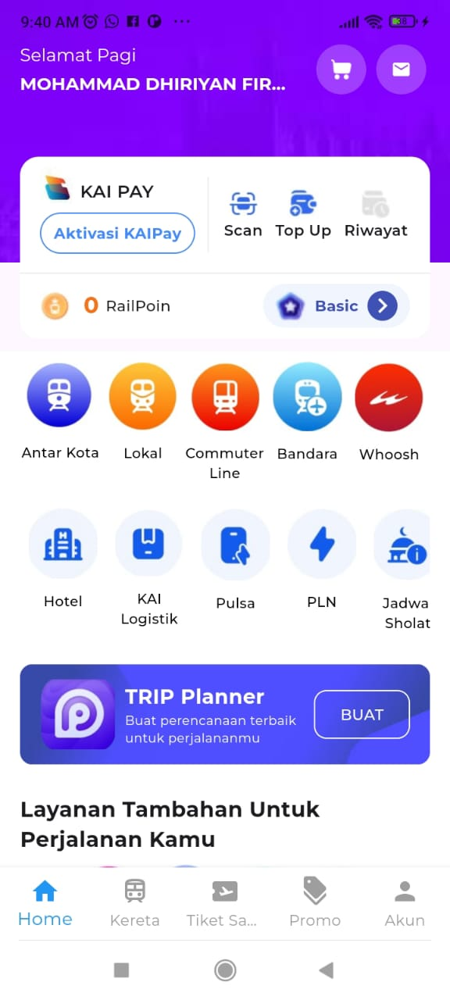
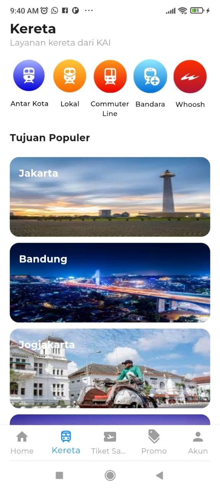

# KAI Access Flutter App

Aplikasi Flutter ini adalah implementasi dari tampilan dan fitur aplikasi KAI Access, yang menampilkan layanan utama seperti pemesanan kereta, layanan tambahan, promo terbaru, serta berbagai fitur pembayaran.

## Fitur Utama

- **KAI Pay**: Aktivasi dan penggunaan KAI Pay untuk pembayaran.
- **RailPoint**: Sistem poin pengguna.
- **Layanan Tambahan**: Layanan seperti Antar Kota, Commuter Line, Bandara, Whoosh, dan lain-lain.
- **Promo Terbaru**: Menampilkan promo-promo terbaru yang tersedia bagi pengguna.
- **Trip Planner**: Fitur perencanaan perjalanan pengguna.

## Screenshot

### Beranda (Home)


Pada halaman ini, pengguna bisa melihat berbagai fitur utama seperti KAI Pay, RailPoint, dan layanan tambahan yang tersedia.

### Halaman Kereta


Menampilkan berbagai pilihan layanan kereta seperti Antar Kota, Lokal, dan Commuter Line, serta tujuan populer.

## Sistem Navigasi

Aplikasi ini menggunakan **Bottom Navigation Bar** untuk memudahkan pengguna berpindah antar halaman utama, serta **Navigator** untuk navigasi antar halaman detail. Berikut adalah penjelasan lengkap tentang sistem navigasi dalam aplikasi ini:

### 1. **Bottom Navigation Bar**

   Bagian bawah aplikasi memiliki **Bottom Navigation Bar** yang memuat ikon-ikon untuk halaman utama, seperti:

   - **Home**: Menampilkan beranda utama dengan fitur utama seperti KAI Pay dan promo.
   - **Kereta**: Menampilkan layanan kereta dan tujuan populer.
   - **Tiket Saya**: Halaman untuk melihat tiket-tiket yang sudah dipesan oleh pengguna.
   - **Promo**: Menampilkan berbagai promo yang tersedia.
   - **Akun**: Halaman profil pengguna untuk mengelola informasi akun.

   Dengan mengklik setiap ikon, pengguna dapat langsung berpindah antar halaman.

### 2. **Navigasi dengan `Navigator`**

   Untuk berpindah ke halaman detail (misalnya halaman detail promo), aplikasi menggunakan metode `Navigator.push`, yang membuka halaman baru di atas halaman saat ini sehingga pengguna dapat kembali dengan menekan tombol back.

   ```dart
   Navigator.push(
     context,
     MaterialPageRoute(builder: (context) => DetailPage()),
   );
   ```

### 3. **Pengelolaan State untuk Navigasi**

   Sistem navigasi menjaga state agar data dan posisi scroll tetap terjaga saat pengguna kembali ke halaman yang telah mereka kunjungi.

### 4. **TabView untuk Sub-Halaman**

   Pada halaman-halaman tertentu, digunakan **TabView** untuk menampilkan sub-konten terkait dalam satu halaman, seperti pada halaman Kereta yang mungkin memiliki beberapa sub-tab berdasarkan kategori layanan.

### 5. **Navigasi ke Halaman Eksternal**

   Beberapa fitur seperti **Scan** dan **Top Up** menggunakan halaman eksternal atau modal popup (dialog) agar pengguna bisa melakukan interaksi cepat tanpa meninggalkan halaman utama.

## Cara Menjalankan Aplikasi

1. Clone repository ini:

   ```bash
   git clone https://github.com/ryapps/kai-access_splacing.git
   ```

2. Pindah ke folder project:

   ```bash
   cd kai-access_splacing
   ```

3. Install dependencies:

   ```bash
   flutter pub get
   ```

4. Jalankan aplikasi:

   ```bash
   flutter run
   ```

---
